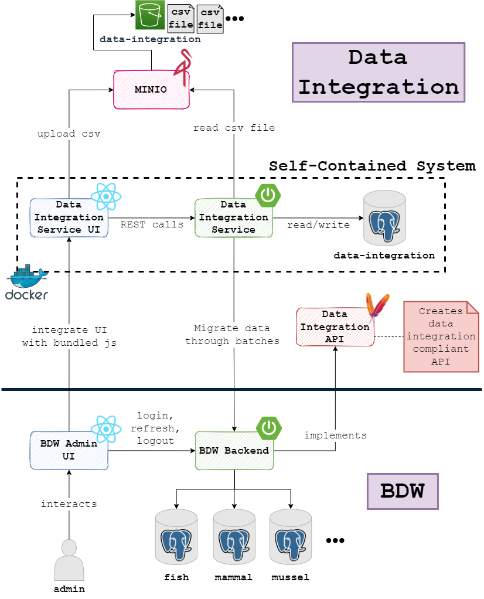

== Data Integration

=== Architecture
Below picture shows the rough architecture of the data integration software world. Everything beneath the thick line is an example application (BDW -> Biodiversity Warehouse).

=== Database model
image::images/databaseModel.svg[]
