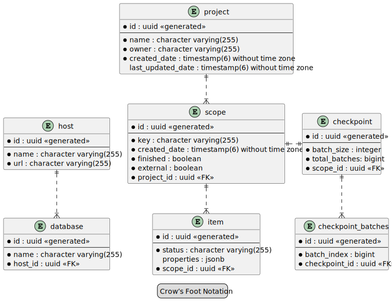

== Data Migration

=== Architecture
Below picture shows the rough architecture of the data migration software world. Everything beneath the thick line is an example application (BDW -> Biodiversity Warehouse).

image::images/test.svg[]

=== Database model

